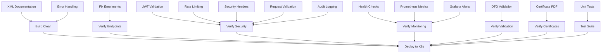

# TASK BREAKDOWN - Road to 10/10 Score

**Document Version**: 1.0
**Created**: 2025-11-10
**Total Tasks**: 72 atomic tasks
**Total Estimated Effort**: 58 hours (~7-8 working days)
**Critical Path**: 42 hours

---

## Executive Summary

This document breaks down the 18 major improvements from ROADMAP-TO-PERFECTION.md into **72 atomic, executable tasks**. Each task is designed to be completed in 15-60 minutes, with clear acceptance criteria and verification commands.

### Quick Stats
- **Total tasks**: 72
- **Critical priority**: 8 tasks (4 hours)
- **High priority**: 28 tasks (24 hours)
- **Medium priority**: 24 tasks (22 hours)
- **Low priority**: 12 tasks (8 hours)
- **Quick wins**: 12 tasks (6 hours) - Fast but high impact

### Progress Tracking
- ✅ Completed: 1 task
- 🔄 Ready to implement: 3 tasks
- ⚪ Not started: 68 tasks

---

## Task Hierarchy

### Phase 1: Critical Fixes (4 tasks, 4 hours) ✅ 25% Complete

#### P1.1: Fix DbContext Navigation Property Error
**Status**: ✅ COMPLETE (2025-11-10)

---

#### P1.2: Add GetAllEnrollmentsAsync to IEnrollmentService Interface
- **Task ID**: P1.2.1
- **Effort**: 5 minutes
- **Priority**: HIGH
- **Dependencies**: None
- **Files**: `/home/mpasqui/insightlearn_WASM/InsightLearn_WASM/src/InsightLearn.Core/Interfaces/IEnrollmentService.cs`
- **Line number**: After line 70

**Steps**:
1. Open IEnrollmentService.cs
2. Add method signature after line 70:
```csharp
/// <summary>
/// Gets all enrollments with pagination (Admin only)
/// </summary>
Task<(List<EnrollmentDto> Enrollments, int TotalCount)> GetAllEnrollmentsAsync(int page = 1, int pageSize = 10);
```

**Acceptance Criteria**:
- [ ] Method signature added to interface
- [ ] XML documentation comment present
- [ ] Build completes without errors

**Verification**:
```bash
dotnet build src/InsightLearn.Core/InsightLearn.Core.csproj
# Expected: Build succeeded, 0 errors
```

---

#### P1.3: Implement GetAllEnrollmentsAsync in EnrollmentService
- **Task ID**: P1.2.2
- **Effort**: 15 minutes
- **Priority**: HIGH
- **Dependencies**: P1.2.1
- **Files**: `/home/mpasqui/insightlearn_WASM/InsightLearn_WASM/src/InsightLearn.Application/Services/EnrollmentService.cs`
- **Line number**: After line 113

**Steps**:
1. Open EnrollmentService.cs
2. Add implementation after line 113:
```csharp
public async Task<(List<EnrollmentDto> Enrollments, int TotalCount)> GetAllEnrollmentsAsync(int page = 1, int pageSize = 10)
{
    _logger.LogInformation("[EnrollmentService] Getting all enrollments (Page: {Page}, PageSize: {PageSize})", page, pageSize);

    var allEnrollments = await _enrollmentRepository.GetAllAsync(page, pageSize);
    var totalCount = await _enrollmentRepository.GetTotalCountAsync();

    var dtos = allEnrollments.Select(MapToDto).ToList();

    _logger.LogInformation("[EnrollmentService] Retrieved {Count} enrollments out of {Total}", dtos.Count, totalCount);
    return (dtos, totalCount);
}
```

**Acceptance Criteria**:
- [ ] Method implemented with logging
- [ ] Uses repository methods (GetAllAsync, GetTotalCountAsync)
- [ ] Returns tuple with enrollments and total count
- [ ] Build completes without errors

**Verification**:
```bash
dotnet build src/InsightLearn.Application/InsightLearn.Application.csproj
# Expected: Build succeeded, 0 errors
```

---

#### P1.4: Update GET /api/enrollments Endpoint
- **Task ID**: P1.2.3
- **Effort**: 10 minutes
- **Priority**: HIGH
- **Dependencies**: P1.2.2
- **Files**: `/home/mpasqui/insightlearn_WASM/InsightLearn_WASM/src/InsightLearn.Application/Program.cs`
- **Line numbers**: Replace lines 2343-2349

**Steps**:
1. Open Program.cs
2. Find GET /api/enrollments endpoint (around line 2343)
3. Replace the 501 NotImplemented response with:
```csharp
logger.LogInformation("[ENROLLMENTS] Admin getting all enrollments, Page: {Page}, PageSize: {PageSize}", page, pageSize);

var (enrollments, totalCount) = await enrollmentService.GetAllEnrollmentsAsync(page, pageSize);

return Results.Ok(new
{
    Enrollments = enrollments,
    TotalCount = totalCount,
    Page = page,
    PageSize = pageSize,
    TotalPages = (int)Math.Ceiling(totalCount / (double)pageSize)
});
```

**Acceptance Criteria**:
- [ ] Endpoint no longer returns 501
- [ ] Endpoint calls service method
- [ ] Returns paginated response with metadata
- [ ] Build completes without errors
- [ ] API starts successfully

**Verification**:
```bash
# Build
dotnet build src/InsightLearn.Application/InsightLearn.Application.csproj

# Test locally (after starting API)
curl -H "Authorization: Bearer YOUR_ADMIN_JWT" \
  http://localhost:31081/api/enrollments?page=1&pageSize=10

# Expected: 200 OK with JSON response containing Enrollments, TotalCount, Page, PageSize, TotalPages
```

---

### Phase 2: Security Hardening (20 tasks, 9 hours) ⚪ 0% Complete

#### P2.1: JWT Secret Validation - Remove Hardcoded Fallback
- **Task ID**: P2.1.1
- **Effort**: 15 minutes
- **Priority**: CRITICAL
- **Dependencies**: None
- **Files**: `/home/mpasqui/insightlearn_WASM/InsightLearn_WASM/src/InsightLearn.Application/Program.cs`
- **Line numbers**: Around 150-180 (JWT configuration section)

**Steps**:
1. Open Program.cs
2. Locate JWT configuration (search for "JwtSettings:SecretKey")
3. Replace fallback pattern with validation:
```csharp
var jwtSecret = builder.Configuration["JwtSettings:SecretKey"];
if (string.IsNullOrWhiteSpace(jwtSecret) || jwtSecret.Length < 32)
{
    throw new InvalidOperationException(
        "JWT Secret Key is not configured or is too short. " +
        "Set JwtSettings:SecretKey in appsettings.json or environment variable. " +
        "Minimum length: 32 characters.");
}

// Validate secret strength
if (jwtSecret == "your-secret-key" || jwtSecret == "changeme" || jwtSecret == "DEFAULT_INSECURE_SECRET")
{
    throw new InvalidOperationException(
        "JWT Secret Key is using a default/weak value. " +
        "Please configure a strong, unique secret key.");
}
```

**Acceptance Criteria**:
- [ ] No hardcoded fallback value
- [ ] Validates minimum length (32 chars)
- [ ] Rejects common weak secrets
- [ ] Throws clear exception with instructions
- [ ] API fails to start without valid secret

**Verification**:
```bash
# Remove JWT secret from config and try to start
JWT_SECRET_KEY="" dotnet run --project src/InsightLearn.Application
# Expected: Exception with message "JWT Secret Key is not configured..."

# Test with weak secret
JWT_SECRET_KEY="changeme" dotnet run --project src/InsightLearn.Application
# Expected: Exception with message "using a default/weak value"

# Test with valid secret
JWT_SECRET_KEY="$(openssl rand -base64 64)" dotnet run --project src/InsightLearn.Application
# Expected: API starts successfully
```

---

#### P2.2: Create JWT Secret Generation Script
- **Task ID**: P2.1.2
- **Effort**: 10 minutes
- **Priority**: HIGH
- **Dependencies**: None
- **Files**: `/home/mpasqui/insightlearn_WASM/InsightLearn_WASM/scripts/generate-jwt-secret.sh` (new file)

**Steps**:
1. Create scripts directory if not exists
2. Create script file with content:
```bash
#!/bin/bash
# Generate cryptographically secure JWT secret
# Usage: ./scripts/generate-jwt-secret.sh

echo "Generating JWT Secret Key..."
SECRET=$(openssl rand -base64 64 | tr -d '\n')
echo ""
echo "Generated JWT Secret (64 bytes, base64 encoded):"
echo "$SECRET"
echo ""
echo "To use in Kubernetes:"
echo "kubectl patch secret insightlearn-secrets -n insightlearn \\"
echo "  --type='json' \\"
echo "  -p='[{\"op\":\"replace\",\"path\":\"/data/jwt-secret-key\",\"value\":\"$(echo -n $SECRET | base64 -w0)\"}]'"
echo ""
echo "To use in Docker Compose (.env file):"
echo "JWT_SECRET_KEY=$SECRET"
```
3. Make executable: `chmod +x scripts/generate-jwt-secret.sh`

**Acceptance Criteria**:
- [ ] Script exists and is executable
- [ ] Generates 64-byte base64 secret
- [ ] Provides Kubernetes patch command
- [ ] Provides Docker Compose example
- [ ] Script runs without errors

**Verification**:
```bash
./scripts/generate-jwt-secret.sh
# Expected: Output with generated secret and usage instructions
```

---

#### P2.3: Update JWT Secret Documentation
- **Task ID**: P2.1.3
- **Effort**: 15 minutes
- **Priority**: MEDIUM
- **Dependencies**: P2.1.2
- **Files**:
  - `/home/mpasqui/insightlearn_WASM/InsightLearn_WASM/CLAUDE.md`
  - `/home/mpasqui/insightlearn_WASM/InsightLearn_WASM/docs/SECURITY.md` (new file)

**Steps**:
1. Update CLAUDE.md security section with new JWT requirements
2. Create docs/SECURITY.md with:
   - JWT secret requirements (min 32 chars)
   - Secret generation instructions
   - Secret rotation procedure
   - K8s secret update commands

**Acceptance Criteria**:
- [ ] CLAUDE.md updated with new JWT validation
- [ ] SECURITY.md created with comprehensive guide
- [ ] Secret rotation procedure documented
- [ ] K8s commands tested and verified

**Verification**:
```bash
# Check files exist and contain key sections
grep -A5 "JWT Secret" CLAUDE.md
grep -A5 "Secret Rotation" docs/SECURITY.md
```

---

#### P2.4: Add Rate Limiter Service Configuration
- **Task ID**: P2.2.1
- **Effort**: 20 minutes
- **Priority**: HIGH
- **Dependencies**: None
- **Files**: `/home/mpasqui/insightlearn_WASM/InsightLearn_WASM/src/InsightLearn.Application/Program.cs`
- **Line number**: After line 81 (after CORS configuration)

**Steps**:
1. Add using: `using System.Threading.RateLimiting;`
2. Add rate limiter configuration after CORS:
```csharp
// Configure Rate Limiting
builder.Services.AddRateLimiter(options =>
{
    // Global rate limit: 100 requests per minute per IP
    options.GlobalLimiter = PartitionedRateLimiter.Create<HttpContext, string>(httpContext =>
        RateLimitPartition.GetFixedWindowLimiter(
            partitionKey: httpContext.Connection.RemoteIpAddress?.ToString() ?? "unknown",
            factory: partition => new FixedWindowRateLimiterOptions
            {
                AutoReplenishment = true,
                PermitLimit = 100,
                Window = TimeSpan.FromMinutes(1)
            }));

    // Authentication endpoints: 5 requests per minute per IP (prevent brute force)
    options.AddPolicy("auth", httpContext =>
        RateLimitPartition.GetFixedWindowLimiter(
            partitionKey: httpContext.Connection.RemoteIpAddress?.ToString() ?? "unknown",
            factory: partition => new FixedWindowRateLimiterOptions
            {
                AutoReplenishment = true,
                PermitLimit = 5,
                Window = TimeSpan.FromMinutes(1)
            }));

    // API endpoints: 30 requests per minute per user (authenticated)
    options.AddPolicy("api", httpContext =>
        RateLimitPartition.GetFixedWindowLimiter(
            partitionKey: httpContext.User.Identity?.Name ?? httpContext.Connection.RemoteIpAddress?.ToString() ?? "unknown",
            factory: partition => new FixedWindowRateLimiterOptions
            {
                AutoReplenishment = true,
                PermitLimit = 30,
                Window = TimeSpan.FromMinutes(1)
            }));

    options.OnRejected = async (context, cancellationToken) =>
    {
        context.HttpContext.Response.StatusCode = 429; // Too Many Requests
        await context.HttpContext.Response.WriteAsJsonAsync(new
        {
            error = "Rate limit exceeded",
            retryAfter = context.Lease.TryGetMetadata(MetadataName.RetryAfter, out var retryAfter)
                ? retryAfter.ToString()
                : "60 seconds"
        }, cancellationToken: cancellationToken);
    };
});
```

**Acceptance Criteria**:
- [ ] Rate limiter service configured
- [ ] Three policies defined (global, auth, api)
- [ ] Custom rejection handler returns 429 with retry-after
- [ ] Build completes without errors

**Verification**:
```bash
dotnet build src/InsightLearn.Application/InsightLearn.Application.csproj
# Expected: Build succeeded, 0 errors
```

---

#### P2.5: Enable Rate Limiter Middleware
- **Task ID**: P2.2.2
- **Effort**: 5 minutes
- **Priority**: HIGH
- **Dependencies**: P2.4
- **Files**: `/home/mpasqui/insightlearn_WASM/InsightLearn_WASM/src/InsightLearn.Application/Program.cs`
- **Line number**: After `app.UseAuthorization()` (around line 140)

**Steps**:
1. Add middleware after authorization:
```csharp
// Enable rate limiting middleware
app.UseRateLimiter();
```

**Acceptance Criteria**:
- [ ] Middleware added to pipeline
- [ ] Positioned after UseAuthorization
- [ ] API starts successfully

**Verification**:
```bash
# Start API and check logs for rate limiter initialization
dotnet run --project src/InsightLearn.Application | grep -i "rate"
```

---

#### P2.6: Apply Rate Limiting to Authentication Endpoints
- **Task ID**: P2.2.3
- **Effort**: 20 minutes
- **Priority**: HIGH
- **Dependencies**: P2.5
- **Files**: `/home/mpasqui/insightlearn_WASM/InsightLearn_WASM/src/InsightLearn.Application/Program.cs`
- **Line numbers**: Authentication endpoints (around lines 800-1000)

**Steps**:
1. Find all authentication endpoints:
   - POST /api/auth/login
   - POST /api/auth/register
   - POST /api/auth/refresh
   - POST /api/auth/oauth-callback
2. Add `.RequireRateLimiting("auth")` to each endpoint:
```csharp
app.MapPost("/api/auth/login", async (...) => { ... })
    .RequireRateLimiting("auth") // ADD THIS
    .WithName("Login")
    .WithTags("Authentication");
```

**Acceptance Criteria**:
- [ ] All 4 auth endpoints have rate limiting
- [ ] Rate limit policy is "auth" (5 req/min)
- [ ] Build completes without errors
- [ ] API starts successfully

**Verification**:
```bash
# Test rate limiting (send 6 login requests in 1 minute)
for i in {1..6}; do
  curl -X POST http://localhost:31081/api/auth/login \
    -H "Content-Type: application/json" \
    -d '{"email":"test@example.com","password":"wrong"}' \
    -w "\nStatus: %{http_code}\n"
  sleep 10
done
# Expected: First 5 return 400/401, 6th returns 429 Too Many Requests
```

---

#### P2.7: Apply Rate Limiting to General API Endpoints
- **Task ID**: P2.2.4
- **Effort**: 30 minutes
- **Priority**: HIGH
- **Dependencies**: P2.5
- **Files**: `/home/mpasqui/insightlearn_WASM/InsightLearn_WASM/src/InsightLearn.Application/Program.cs`
- **Line numbers**: All non-auth endpoints

**Steps**:
1. Find all API endpoints (courses, enrollments, payments, reviews, users)
2. Add `.RequireRateLimiting("api")` to each GET/POST/PUT/DELETE endpoint
3. Count: Should be ~27 endpoints (31 total - 4 auth)

**Acceptance Criteria**:
- [ ] 27+ endpoints have rate limiting
- [ ] Rate limit policy is "api" (30 req/min)
- [ ] Build completes without errors
- [ ] No endpoints missed

**Verification**:
```bash
# Grep for endpoints without rate limiting
grep -n "app.Map" src/InsightLearn.Application/Program.cs | \
  grep -v "RequireRateLimiting" | \
  grep -v "health" | \
  grep -v "swagger"
# Expected: Only health and swagger endpoints (no rate limit needed)
```

---

#### P2.8: Test Rate Limiting with Load Test
- **Task ID**: P2.2.5
- **Effort**: 15 minutes
- **Priority**: HIGH
- **Dependencies**: P2.7
- **Files**: None (testing task)

**Steps**:
1. Start API locally or in K8s
2. Run load test:
```bash
# Test global rate limit (100 req/min)
for i in {1..110}; do
  curl -s http://localhost:31081/health -o /dev/null -w "%{http_code}\n"
done | grep "429" | wc -l
# Expected: At least 10 responses with 429

# Test auth rate limit (5 req/min)
for i in {1..10}; do
  curl -s -X POST http://localhost:31081/api/auth/login \
    -H "Content-Type: application/json" \
    -d '{"email":"test@example.com","password":"wrong"}' \
    -o /dev/null -w "%{http_code}\n"
done | grep "429" | wc -l
# Expected: At least 5 responses with 429
```

**Acceptance Criteria**:
- [ ] Global rate limit enforced (429 after 100 req/min)
- [ ] Auth rate limit enforced (429 after 5 req/min)
- [ ] 429 response includes retry-after header
- [ ] Rate limits reset after window expires

**Verification**: See steps above

---

#### P2.9: Add Security Headers Middleware
- **Task ID**: P2.3.1
- **Effort**: 20 minutes
- **Priority**: HIGH
- **Dependencies**: None
- **Files**: `/home/mpasqui/insightlearn_WASM/InsightLearn_WASM/src/InsightLearn.Application/Program.cs`
- **Line number**: After `app.UseHttpsRedirection()` (around line 130)

**Steps**:
1. Add security headers middleware:
```csharp
// Add security headers middleware
app.Use(async (context, next) =>
{
    // Prevent clickjacking
    context.Response.Headers.Add("X-Frame-Options", "DENY");

    // Prevent MIME-sniffing
    context.Response.Headers.Add("X-Content-Type-Options", "nosniff");

    // XSS protection (legacy but still useful)
    context.Response.Headers.Add("X-XSS-Protection", "1; mode=block");

    // Strict Transport Security (HSTS)
    context.Response.Headers.Add("Strict-Transport-Security", "max-age=31536000; includeSubDomains");

    // Content Security Policy
    context.Response.Headers.Add("Content-Security-Policy",
        "default-src 'self'; " +
        "script-src 'self' 'unsafe-eval' 'wasm-unsafe-eval'; " +
        "style-src 'self' 'unsafe-inline'; " +
        "img-src 'self' data: https:; " +
        "font-src 'self' data:; " +
        "connect-src 'self' wss: https:; " +
        "frame-ancestors 'self'; " +
        "base-uri 'self'; " +
        "form-action 'self'");

    // Referrer Policy
    context.Response.Headers.Add("Referrer-Policy", "strict-origin-when-cross-origin");

    // Permissions Policy (formerly Feature-Policy)
    context.Response.Headers.Add("Permissions-Policy",
        "geolocation=(), " +
        "microphone=(), " +
        "camera=()");

    await next();
});
```

**Acceptance Criteria**:
- [ ] 7 security headers added
- [ ] CSP policy configured for Blazor WASM
- [ ] HSTS with 1-year max-age
- [ ] Build completes without errors
- [ ] API starts successfully

**Verification**:
```bash
# Test headers
curl -I http://localhost:31081/health | grep -E "(X-Frame|X-Content|X-XSS|Strict-Transport|Content-Security|Referrer|Permissions)"
# Expected: 7 headers present in response
```

---

#### P2.10: Update K8s Ingress with Security Headers
- **Task ID**: P2.3.2
- **Effort**: 15 minutes
- **Priority**: HIGH
- **Dependencies**: None
- **Files**: `/home/mpasqui/insightlearn_WASM/InsightLearn_WASM/k8s/08-ingress.yaml`

**Steps**:
1. Open ingress manifest
2. Add or update annotations section:
```yaml
metadata:
  annotations:
    nginx.ingress.kubernetes.io/configuration-snippet: |
      more_set_headers "X-Frame-Options: DENY";
      more_set_headers "X-Content-Type-Options: nosniff";
      more_set_headers "X-XSS-Protection: 1; mode=block";
      more_set_headers "Strict-Transport-Security: max-age=31536000; includeSubDomains";
      more_set_headers "Referrer-Policy: strict-origin-when-cross-origin";
```

**Acceptance Criteria**:
- [ ] Ingress annotations updated
- [ ] Headers match Program.cs middleware
- [ ] YAML is valid

**Verification**:
```bash
# Validate YAML
kubectl apply --dry-run=client -f k8s/08-ingress.yaml
# Expected: No errors

# Apply and test
kubectl apply -f k8s/08-ingress.yaml
curl -I http://$(kubectl get ingress -n insightlearn -o jsonpath='{.items[0].status.loadBalancer.ingress[0].ip}')/health
# Expected: Security headers present
```

---

#### P2.11: Create RequestValidationMiddleware Class
- **Task ID**: P2.4.1
- **Effort**: 30 minutes
- **Priority**: HIGH
- **Dependencies**: None
- **Files**: `/home/mpasqui/insightlearn_WASM/InsightLearn_WASM/src/InsightLearn.Application/Middleware/RequestValidationMiddleware.cs` (new file)

**Steps**:
1. Create Middleware directory if not exists
2. Create RequestValidationMiddleware.cs with content from roadmap (lines 344-425)
3. Implement SQL injection and XSS detection patterns
4. Add payload size validation
5. Add logging for malicious requests

**Acceptance Criteria**:
- [ ] Middleware class created
- [ ] SQL injection regex pattern implemented
- [ ] XSS regex pattern implemented
- [ ] Query parameter validation
- [ ] Header validation
- [ ] Content-length check (10MB limit)
- [ ] Logging on detection
- [ ] Build completes without errors

**Verification**:
```bash
dotnet build src/InsightLearn.Application/InsightLearn.Application.csproj
# Expected: Build succeeded, 0 errors
```

---

#### P2.12: Register RequestValidationMiddleware
- **Task ID**: P2.4.2
- **Effort**: 5 minutes
- **Priority**: HIGH
- **Dependencies**: P2.11
- **Files**: `/home/mpasqui/insightlearn_WASM/InsightLearn_WASM/src/InsightLearn.Application/Program.cs`
- **Line number**: After `app.UseCors()` (around line 125)

**Steps**:
1. Add middleware registration:
```csharp
app.UseMiddleware<RequestValidationMiddleware>();
```

**Acceptance Criteria**:
- [ ] Middleware registered
- [ ] Positioned after CORS, before authentication
- [ ] API starts successfully

**Verification**:
```bash
dotnet run --project src/InsightLearn.Application | grep -i "validation"
```

---

#### P2.13: Test Request Validation Middleware
- **Task ID**: P2.4.3
- **Effort**: 20 minutes
- **Priority**: HIGH
- **Dependencies**: P2.12
- **Files**: None (testing task)

**Steps**:
1. Test SQL injection detection:
```bash
curl "http://localhost:31081/api/courses?search=';DROP TABLE Users--" -v
# Expected: 400 Bad Request, malicious content detected
```

2. Test XSS detection:
```bash
curl "http://localhost:31081/api/courses?name=<script>alert('xss')</script>" -v
# Expected: 400 Bad Request
```

3. Test large payload:
```bash
dd if=/dev/zero bs=1M count=11 | curl -X POST http://localhost:31081/api/video/upload --data-binary @- -v
# Expected: 413 Payload Too Large
```

**Acceptance Criteria**:
- [ ] SQL injection patterns blocked
- [ ] XSS patterns blocked
- [ ] Large payloads rejected
- [ ] Legitimate requests pass through
- [ ] Security warnings logged

**Verification**: See steps above

---

#### P2.14: Create AuditLog Entity
- **Task ID**: P2.5.1
- **Effort**: 15 minutes
- **Priority**: HIGH
- **Dependencies**: None
- **Files**: `/home/mpasqui/insightlearn_WASM/InsightLearn_WASM/src/InsightLearn.Core/Entities/AuditLog.cs` (new file)

**Steps**:
1. Create AuditLog.cs in Entities folder
2. Add entity properties (from roadmap lines 507-525):
   - Id (Guid, PK)
   - UserId (Guid?, nullable)
   - UserEmail (string?)
   - Action (string)
   - EntityType (string)
   - EntityId (Guid?, nullable)
   - IpAddress (string)
   - UserAgent (string)
   - Details (string?, JSON)
   - Timestamp (DateTime)
   - Navigation property to User

**Acceptance Criteria**:
- [ ] Entity class created
- [ ] All properties defined with correct types
- [ ] Navigation property to User
- [ ] Build completes without errors

**Verification**:
```bash
dotnet build src/InsightLearn.Core/InsightLearn.Core.csproj
```

---

#### P2.15: Add AuditLog to DbContext
- **Task ID**: P2.5.2
- **Effort**: 5 minutes
- **Priority**: HIGH
- **Dependencies**: P2.14
- **Files**: `/home/mpasqui/insightlearn_WASM/InsightLearn_WASM/src/InsightLearn.Infrastructure/Data/InsightLearnDbContext.cs`

**Steps**:
1. Add DbSet property:
```csharp
public DbSet<AuditLog> AuditLogs { get; set; } = null!;
```

**Acceptance Criteria**:
- [ ] DbSet added to context
- [ ] Build completes without errors

**Verification**:
```bash
dotnet build src/InsightLearn.Infrastructure/InsightLearn.Infrastructure.csproj
```

---

#### P2.16: Create AuditService Interface and Implementation
- **Task ID**: P2.5.3
- **Effort**: 30 minutes
- **Priority**: HIGH
- **Dependencies**: P2.15
- **Files**: `/home/mpasqui/insightlearn_WASM/InsightLearn_WASM/src/InsightLearn.Application/Services/AuditService.cs` (new file)

**Steps**:
1. Create AuditService.cs with interface and implementation (from roadmap lines 536-581)
2. Implement LogAsync method with:
   - Create AuditLog entry
   - Extract user info from HttpContext
   - Extract IP address
   - Extract User-Agent
   - Save to database
   - Log success/failure

**Acceptance Criteria**:
- [ ] IAuditService interface defined
- [ ] AuditService implementation complete
- [ ] LogAsync method implemented
- [ ] Error handling for save failures
- [ ] Build completes without errors

**Verification**:
```bash
dotnet build src/InsightLearn.Application/InsightLearn.Application.csproj
```

---

#### P2.17: Register AuditService in DI Container
- **Task ID**: P2.5.4
- **Effort**: 5 minutes
- **Priority**: HIGH
- **Dependencies**: P2.16
- **Files**: `/home/mpasqui/insightlearn_WASM/InsightLearn_WASM/src/InsightLearn.Application/Program.cs`
- **Line number**: With other service registrations (around line 90-100)

**Steps**:
1. Add service registration:
```csharp
builder.Services.AddScoped<IAuditService, AuditService>();
```

**Acceptance Criteria**:
- [ ] Service registered as scoped
- [ ] API starts successfully

**Verification**:
```bash
dotnet run --project src/InsightLearn.Application | grep -i "audit"
```

---

#### P2.18: Create and Apply AuditLog Migration
- **Task ID**: P2.5.5
- **Effort**: 15 minutes
- **Priority**: HIGH
- **Dependencies**: P2.17
- **Files**: None (generates migration)

**Steps**:
1. Create migration:
```bash
cd src/InsightLearn.Infrastructure
dotnet ef migrations add AddAuditLog --startup-project ../InsightLearn.Application
```

2. Review generated migration
3. Apply migration (or let automatic migration handle it):
```bash
dotnet ef database update --startup-project ../InsightLearn.Application
```

**Acceptance Criteria**:
- [ ] Migration created successfully
- [ ] AuditLogs table created
- [ ] Foreign key to Users table
- [ ] Indexes on UserId, Timestamp, Action
- [ ] Migration applied without errors

**Verification**:
```bash
# Check migration files
ls -la src/InsightLearn.Infrastructure/Migrations/ | grep AuditLog

# Verify table exists (after migration)
# Connect to SQL Server and check
```

---

#### P2.19: Add Audit Logging to Critical Endpoints
- **Task ID**: P2.5.6
- **Effort**: 45 minutes
- **Priority**: HIGH
- **Dependencies**: P2.18
- **Files**: `/home/mpasqui/insightlearn_WASM/InsightLearn_WASM/src/InsightLearn.Application/Program.cs`

**Steps**:
1. Identify critical endpoints requiring audit logging:
   - DELETE /api/courses/{id} (admin action)
   - DELETE /api/users/{id} (admin action)
   - PUT /api/users/{id} (user profile update)
   - POST /api/enrollments (enrollment creation)
   - POST /api/payments/create-checkout (payment)
   - DELETE /api/enrollments/{id} (admin action)

2. Add IAuditService injection to each endpoint
3. Add audit log call after successful operation:
```csharp
await auditService.LogAsync("DeleteCourse", "Course", id, userId, context);
```

**Acceptance Criteria**:
- [ ] At least 6 critical endpoints have audit logging
- [ ] Audit log called after successful operation
- [ ] UserId extracted from JWT claims
- [ ] Build completes without errors

**Verification**:
```bash
# Perform admin action (delete course)
# Check AuditLogs table for entry
# Verify UserId, IpAddress, Timestamp populated
```

---

#### P2.20: Test Audit Logging End-to-End
- **Task ID**: P2.5.7
- **Effort**: 20 minutes
- **Priority**: HIGH
- **Dependencies**: P2.19
- **Files**: None (testing task)

**Steps**:
1. Start API with database
2. Perform audited action (e.g., delete course)
3. Query AuditLogs table
4. Verify log entry contains:
   - UserId
   - UserEmail
   - Action name
   - EntityType
   - EntityId
   - IpAddress
   - UserAgent
   - Timestamp

**Acceptance Criteria**:
- [ ] Audit log entry created
- [ ] All fields populated correctly
- [ ] Timestamp is UTC
- [ ] IP address captured
- [ ] User agent captured

**Verification**:
```sql
SELECT TOP 10 * FROM AuditLogs ORDER BY Timestamp DESC;
-- Expected: Recent entries with all fields populated
```

---

### Phase 3: Validation & Data Integrity (8 tasks, 7.5 hours) ⚪ 0% Complete

#### P3.1: Add Validation to Enrollment DTOs
- **Task ID**: P3.1.1
- **Effort**: 30 minutes
- **Priority**: HIGH
- **Dependencies**: None
- **Files**:
  - `/home/mpasqui/insightlearn_WASM/InsightLearn_WASM/src/InsightLearn.Core/DTOs/Enrollment/CreateEnrollmentDto.cs`
  - `/home/mpasqui/insightlearn_WASM/InsightLearn_WASM/src/InsightLearn.Core/DTOs/Enrollment/UpdateProgressDto.cs`
  - Other enrollment DTOs

**Steps**:
1. Add `using System.ComponentModel.DataAnnotations;`
2. Add validation attributes to CreateEnrollmentDto:
   - UserId: [Required]
   - CourseId: [Required]
   - AmountPaid: [Range(0, 10000)], [DataType(DataType.Currency)]
3. Add to UpdateProgressDto:
   - EnrollmentId: [Required]
   - UserId: [Required]
   - LessonId: [Required]
   - WatchedMinutes: [Range(0, 10000)]

**Acceptance Criteria**:
- [ ] All 6 enrollment DTOs have validation
- [ ] Required fields marked
- [ ] Ranges validated
- [ ] Build completes without errors

**Verification**:
```bash
dotnet build src/InsightLearn.Core/InsightLearn.Core.csproj
```

---

#### P3.2: Add Validation to Course DTOs
- **Task ID**: P3.1.2
- **Effort**: 45 minutes
- **Priority**: HIGH
- **Dependencies**: None
- **Files**: All course DTOs in `/home/mpasqui/insightlearn_WASM/InsightLearn_WASM/src/InsightLearn.Core/DTOs/Course/`

**Steps**:
1. Add validation to CreateCourseDto (8 files):
   - Title: [Required], [StringLength(200, MinimumLength = 5)]
   - Description: [Required], [StringLength(5000, MinimumLength = 20)]
   - CategoryId: [Required]
   - InstructorId: [Required]
   - Price: [Range(0, 10000)], [DataType(DataType.Currency)]
   - DiscountPercentage: [Range(0, 100)]
   - DifficultyLevel: [RegularExpression("^(Beginner|Intermediate|Advanced|Expert)$")]
   - Language: [Required], [StringLength(50)]
   - ThumbnailUrl: [Url], [StringLength(500)]
   - PreviewVideoUrl: [Url], [StringLength(500)]

**Acceptance Criteria**:
- [ ] All 8 course DTOs validated
- [ ] URL validation on image/video fields
- [ ] Enum validation on difficulty
- [ ] Build completes without errors

**Verification**:
```bash
dotnet build src/InsightLearn.Core/InsightLearn.Core.csproj

# Test invalid course data
curl -X POST http://localhost:31081/api/courses \
  -H "Content-Type: application/json" \
  -d '{"title":"X","price":-1}'
# Expected: 400 Bad Request with validation errors
```

---

#### P3.3: Add Validation to Category DTOs
- **Task ID**: P3.1.3
- **Effort**: 20 minutes
- **Priority**: HIGH
- **Dependencies**: None
- **Files**: Category DTOs (4 files)

**Steps**:
1. Add validation to CreateCategoryDto, UpdateCategoryDto:
   - Name: [Required], [StringLength(100, MinimumLength = 2)]
   - Description: [StringLength(1000)]
   - ImageUrl: [Url], [StringLength(500)]

**Acceptance Criteria**:
- [ ] All 4 category DTOs validated
- [ ] Build completes without errors

**Verification**:
```bash
dotnet build src/InsightLearn.Core/InsightLearn.Core.csproj
```

---

#### P3.4: Add Validation to Payment DTOs
- **Task ID**: P3.1.4
- **Effort**: 30 minutes
- **Priority**: HIGH
- **Dependencies**: None
- **Files**: Payment DTOs (6 files)

**Steps**:
1. Add validation:
   - Amount: [Required], [Range(0.01, 100000)], [DataType(DataType.Currency)]
   - Currency: [Required], [StringLength(3)]
   - UserId: [Required]
   - EnrollmentId: [Required]

**Acceptance Criteria**:
- [ ] All 6 payment DTOs validated
- [ ] Minimum amount enforced (0.01)
- [ ] Build completes without errors

**Verification**:
```bash
dotnet build src/InsightLearn.Core/InsightLearn.Core.csproj
```

---

#### P3.5: Add Validation to Review DTOs
- **Task ID**: P3.1.5
- **Effort**: 20 minutes
- **Priority**: MEDIUM
- **Dependencies**: None
- **Files**: Review DTOs (4 files)

**Steps**:
1. Add validation:
   - Rating: [Required], [Range(1, 5)]
   - Comment: [StringLength(2000)]
   - CourseId: [Required]
   - UserId: [Required]

**Acceptance Criteria**:
- [ ] All 4 review DTOs validated
- [ ] Rating constrained to 1-5
- [ ] Build completes without errors

**Verification**:
```bash
dotnet build src/InsightLearn.Core/InsightLearn.Core.csproj
```

---

#### P3.6: Add Validation to Auth DTOs
- **Task ID**: P3.1.6
- **Effort**: 30 minutes
- **Priority**: HIGH
- **Dependencies**: None
- **Files**: Auth DTOs (5 files)

**Steps**:
1. Add validation to LoginDto:
   - Email: [Required], [EmailAddress]
   - Password: [Required], [StringLength(100, MinimumLength = 8)]
2. Add to RegisterDto:
   - Email: [Required], [EmailAddress]
   - Password: [Required], [StringLength(100, MinimumLength = 8)]
   - ConfirmPassword: [Compare("Password")]
   - FullName: [Required], [StringLength(100)]

**Acceptance Criteria**:
- [ ] All 5 auth DTOs validated
- [ ] Email format validated
- [ ] Password length enforced (min 8 chars)
- [ ] Password confirmation match
- [ ] Build completes without errors

**Verification**:
```bash
# Test invalid email
curl -X POST http://localhost:31081/api/auth/register \
  -H "Content-Type: application/json" \
  -d '{"email":"notanemail","password":"short"}'
# Expected: 400 with validation errors for email and password
```

---

#### P3.7: Add Validation to User and Admin DTOs
- **Task ID**: P3.1.7
- **Effort**: 45 minutes
- **Priority**: MEDIUM
- **Dependencies**: None
- **Files**: User DTOs (5 files), Admin DTOs (10 files)

**Steps**:
1. Add validation to all remaining DTOs (15 total)
2. Focus on:
   - Email fields: [EmailAddress]
   - Required fields: [Required]
   - String lengths: [StringLength(max)]
   - Numeric ranges: [Range(min, max)]

**Acceptance Criteria**:
- [ ] All 15 DTOs validated
- [ ] No DTO missing validation
- [ ] Build completes without errors

**Verification**:
```bash
# Check all DTOs have validation attributes
find src/InsightLearn.Core/DTOs/ -name "*.cs" -exec grep -L "Required\|StringLength\|Range\|EmailAddress" {} \;
# Expected: Empty result (all DTOs have at least one validation attribute)
```

---

#### P3.8: Enable Automatic Model Validation and Test
- **Task ID**: P3.1.8
- **Effort**: 30 minutes
- **Priority**: HIGH
- **Dependencies**: P3.1.1-P3.1.7
- **Files**: `/home/mpasqui/insightlearn_WASM/InsightLearn_WASM/src/InsightLearn.Application/Program.cs`

**Steps**:
1. Verify ApiBehaviorOptions configuration (around line 67-70):
```csharp
builder.Services.Configure<ApiBehaviorOptions>(options =>
{
    options.SuppressModelStateInvalidFilter = false; // Validation enabled
});
```

2. Test validation on multiple endpoints:
```bash
# Test enrollment validation
curl -X POST http://localhost:31081/api/enrollments \
  -H "Content-Type: application/json" \
  -d '{"userId":"invalid-guid","courseId":"invalid-guid","amountPaid":-1}'

# Test course validation
curl -X POST http://localhost:31081/api/courses \
  -H "Content-Type: application/json" \
  -d '{"title":"X","price":99999}'

# Test auth validation
curl -X POST http://localhost:31081/api/auth/register \
  -H "Content-Type: application/json" \
  -d '{"email":"notanemail","password":"123"}'
```

**Acceptance Criteria**:
- [ ] All endpoints return 400 for invalid data
- [ ] Validation errors include field names and messages
- [ ] Valid data passes validation
- [ ] API returns proper error format

**Verification**: See steps above (all should return 400 Bad Request)

---

### Phase 4: Deployment & Monitoring (12 tasks, 7 hours) ⚪ 0% Complete

#### P4.1: Add SQL Server Health Check
- **Task ID**: P4.1.1
- **Effort**: 15 minutes
- **Priority**: HIGH
- **Dependencies**: None
- **Files**: `/home/mpasqui/insightlearn_WASM/InsightLearn_WASM/src/InsightLearn.Application/Program.cs`
- **Line number**: Replace existing health check config (around line 240-250)

**Steps**:
1. Replace existing AddHealthChecks() with comprehensive version:
```csharp
builder.Services.AddHealthChecks()
    // SQL Server database
    .AddSqlServer(
        connectionString: connectionString,
        name: "sqlserver",
        failureStatus: HealthStatus.Unhealthy,
        tags: new[] { "db", "sql", "sqlserver" },
        timeout: TimeSpan.FromSeconds(5))
```

**Acceptance Criteria**:
- [ ] SQL Server health check added
- [ ] Timeout set to 5 seconds
- [ ] Tagged appropriately
- [ ] Build completes without errors

**Verification**:
```bash
dotnet build src/InsightLearn.Application/InsightLearn.Application.csproj
```

---

#### P4.2: Add MongoDB Health Check
- **Task ID**: P4.1.2
- **Effort**: 10 minutes
- **Priority**: HIGH
- **Dependencies**: P4.1
- **Files**: `/home/mpasqui/insightlearn_WASM/InsightLearn_WASM/src/InsightLearn.Application/Program.cs`

**Steps**:
1. Add MongoDB health check to chain:
```csharp
    .AddMongoDb(
        mongodbConnectionString: mongoConnectionString,
        name: "mongodb",
        failureStatus: HealthStatus.Unhealthy,
        tags: new[] { "db", "mongodb", "videos" },
        timeout: TimeSpan.FromSeconds(5))
```

**Acceptance Criteria**:
- [ ] MongoDB health check added
- [ ] Uses existing mongoConnectionString variable
- [ ] Build completes without errors

**Verification**:
```bash
dotnet build src/InsightLearn.Application/InsightLearn.Application.csproj
```

---

#### P4.3: Add Redis Health Check
- **Task ID**: P4.1.3
- **Effort**: 10 minutes
- **Priority**: HIGH
- **Dependencies**: P4.2
- **Files**: `/home/mpasqui/insightlearn_WASM/InsightLearn_WASM/src/InsightLearn.Application/Program.cs`

**Steps**:
1. Add Redis health check:
```csharp
    .AddRedis(
        redisConnectionString: builder.Configuration["Redis:ConnectionString"] ?? "redis-service:6379",
        name: "redis",
        failureStatus: HealthStatus.Degraded, // Cache failure is not critical
        tags: new[] { "cache", "redis" },
        timeout: TimeSpan.FromSeconds(3))
```

**Acceptance Criteria**:
- [ ] Redis health check added
- [ ] Failure status is Degraded (not critical)
- [ ] Build completes without errors

**Verification**:
```bash
dotnet build src/InsightLearn.Application/InsightLearn.Application.csproj
```

---

#### P4.4: Add Elasticsearch Health Check
- **Task ID**: P4.1.4
- **Effort**: 10 minutes
- **Priority**: MEDIUM
- **Dependencies**: P4.3
- **Files**: `/home/mpasqui/insightlearn_WASM/InsightLearn_WASM/src/InsightLearn.Application/Program.cs`

**Steps**:
1. Add Elasticsearch health check:
```csharp
    .AddElasticsearch(
        elasticsearchUri: builder.Configuration["Elasticsearch:Url"] ?? "http://elasticsearch:9200",
        name: "elasticsearch",
        failureStatus: HealthStatus.Degraded,
        tags: new[] { "search", "elasticsearch" },
        timeout: TimeSpan.FromSeconds(5))
```

**Acceptance Criteria**:
- [ ] Elasticsearch health check added
- [ ] Failure status is Degraded
- [ ] Build completes without errors

**Verification**:
```bash
dotnet build src/InsightLearn.Application/InsightLearn.Application.csproj
```

---

#### P4.5: Add Ollama Health Check
- **Task ID**: P4.1.5
- **Effort**: 15 minutes
- **Priority**: MEDIUM
- **Dependencies**: P4.4
- **Files**: `/home/mpasqui/insightlearn_WASM/InsightLearn_WASM/src/InsightLearn.Application/Program.cs`

**Steps**:
1. Add Ollama health check using URL group:
```csharp
    .AddUrlGroup(
        uri: new Uri($"{ollamaUrl}/api/tags"),
        name: "ollama",
        failureStatus: HealthStatus.Degraded,
        tags: new[] { "ai", "ollama", "chatbot" },
        timeout: TimeSpan.FromSeconds(5));
```

**Acceptance Criteria**:
- [ ] Ollama health check added
- [ ] Uses existing ollamaUrl variable
- [ ] Checks /api/tags endpoint
- [ ] Build completes without errors

**Verification**:
```bash
dotnet build src/InsightLearn.Application/InsightLearn.Application.csproj
```

---

#### P4.6: Create Health Check Endpoints (live, ready, detailed)
- **Task ID**: P4.1.6
- **Effort**: 30 minutes
- **Priority**: HIGH
- **Dependencies**: P4.5
- **Files**: `/home/mpasqui/insightlearn_WASM/InsightLearn_WASM/src/InsightLearn.Application/Program.cs`

**Steps**:
1. Replace existing /health endpoint mapping with three endpoints:

```csharp
// Detailed health check (all dependencies)
app.MapHealthChecks("/health", new HealthCheckOptions
{
    ResponseWriter = async (context, report) =>
    {
        context.Response.ContentType = "application/json";

        var response = new
        {
            status = report.Status.ToString(),
            totalDuration = report.TotalDuration.TotalMilliseconds,
            checks = report.Entries.Select(e => new
            {
                name = e.Key,
                status = e.Value.Status.ToString(),
                duration = e.Value.Duration.TotalMilliseconds,
                description = e.Value.Description,
                data = e.Value.Data,
                exception = e.Value.Exception?.Message,
                tags = e.Value.Tags
            })
        };

        await context.Response.WriteAsJsonAsync(response);
    }
});

// Liveness probe (basic API check, no dependencies)
app.MapHealthChecks("/health/live", new HealthCheckOptions
{
    Predicate = _ => false // No checks, just returns 200 if API is running
});

// Readiness probe (checks critical dependencies only)
app.MapHealthChecks("/health/ready", new HealthCheckOptions
{
    Predicate = check => check.Tags.Contains("db") || check.Tags.Contains("sql")
});
```

**Acceptance Criteria**:
- [ ] Three health endpoints created
- [ ] /health returns detailed status
- [ ] /health/live returns 200 always
- [ ] /health/ready checks critical deps only
- [ ] API starts successfully

**Verification**:
```bash
# Test all health endpoints
curl http://localhost:31081/health | jq
curl http://localhost:31081/health/live
curl http://localhost:31081/health/ready
```

---

#### P4.7: Update K8s Deployment Health Probes
- **Task ID**: P4.1.7
- **Effort**: 15 minutes
- **Priority**: HIGH
- **Dependencies**: P4.6
- **Files**: `/home/mpasqui/insightlearn_WASM/InsightLearn_WASM/k8s/06-api-deployment.yaml`

**Steps**:
1. Update livenessProbe to use /health/live
2. Update readinessProbe to use /health/ready
3. Adjust timing parameters:

```yaml
        livenessProbe:
          httpGet:
            path: /health/live
            port: 80
          initialDelaySeconds: 40
          periodSeconds: 30
          timeoutSeconds: 5
          failureThreshold: 3
        readinessProbe:
          httpGet:
            path: /health/ready
            port: 80
          initialDelaySeconds: 20
          periodSeconds: 10
          timeoutSeconds: 10
          failureThreshold: 3
```

**Acceptance Criteria**:
- [ ] Probes updated to use new endpoints
- [ ] Timing parameters appropriate
- [ ] YAML is valid

**Verification**:
```bash
kubectl apply --dry-run=client -f k8s/06-api-deployment.yaml
kubectl apply -f k8s/06-api-deployment.yaml
kubectl rollout status deployment/insightlearn-api -n insightlearn
```

---

#### P4.8: Create MetricsService Class
- **Task ID**: P4.2.1
- **Effort**: 45 minutes
- **Priority**: MEDIUM
- **Dependencies**: None
- **Files**: `/home/mpasqui/insightlearn_WASM/InsightLearn_WASM/src/InsightLearn.Application/Services/MetricsService.cs` (new file)

**Steps**:
1. Create MetricsService.cs with Prometheus metrics (from roadmap lines 946-1048):
   - Counters: API requests, enrollments, payments
   - Gauges: Active users, active enrollments
   - Histograms: API duration, Ollama inference
   - Summary: Video upload size
2. Add helper methods:
   - RecordApiRequest()
   - MeasureApiDuration()
   - RecordEnrollment()
   - RecordPayment()
   - SetActiveUsers()
   - SetActiveEnrollments()
   - MeasureOllamaInference()
   - RecordVideoUpload()

**Acceptance Criteria**:
- [ ] MetricsService class created
- [ ] 7 metric types defined
- [ ] 8 helper methods implemented
- [ ] Build completes without errors

**Verification**:
```bash
dotnet build src/InsightLearn.Application/InsightLearn.Application.csproj
```

---

#### P4.9: Register MetricsService and Add Metrics Middleware
- **Task ID**: P4.2.2
- **Effort**: 20 minutes
- **Priority**: MEDIUM
- **Dependencies**: P4.8
- **Files**: `/home/mpasqui/insightlearn_WASM/InsightLearn_WASM/src/InsightLearn.Application/Program.cs`

**Steps**:
1. Register service as singleton:
```csharp
builder.Services.AddSingleton<MetricsService>();
```

2. Add metrics middleware before endpoints:
```csharp
app.Use(async (context, next) =>
{
    var metricsService = context.RequestServices.GetRequiredService<MetricsService>();

    using (metricsService.MeasureApiDuration(context.Request.Method, context.Request.Path))
    {
        await next();
    }

    metricsService.RecordApiRequest(context.Request.Method, context.Request.Path, context.Response.StatusCode);
});
```

**Acceptance Criteria**:
- [ ] Service registered as singleton
- [ ] Middleware added to pipeline
- [ ] All requests tracked
- [ ] API starts successfully

**Verification**:
```bash
# Make some requests
curl http://localhost:31081/health
curl http://localhost:31081/api/info

# Check metrics endpoint
curl http://localhost:31081/metrics | grep "insightlearn"
# Expected: Custom metrics present
```

---

#### P4.10: Integrate Metrics into Services
- **Task ID**: P4.2.3
- **Effort**: 45 minutes
- **Priority**: MEDIUM
- **Dependencies**: P4.9
- **Files**:
  - `/home/mpasqui/insightlearn_WASM/InsightLearn_WASM/src/InsightLearn.Application/Services/EnrollmentService.cs`
  - `/home/mpasqui/insightlearn_WASM/InsightLearn_WASM/src/InsightLearn.Application/Services/PaymentService.cs`
  - `/home/mpasqui/insightlearn_WASM/InsightLearn_WASM/src/InsightLearn.Application/Services/OllamaService.cs`

**Steps**:
1. Inject MetricsService into service constructors
2. Add metrics calls:
   - EnrollmentService.EnrollUserAsync(): Call RecordEnrollment()
   - PaymentService: Call RecordPayment(status)
   - OllamaService: Wrap inference with MeasureOllamaInference()
   - VideoStorageService: Call RecordVideoUpload(sizeBytes)

**Acceptance Criteria**:
- [ ] At least 4 services instrumented
- [ ] Metrics called at appropriate points
- [ ] Build completes without errors

**Verification**:
```bash
# Perform actions (enroll, pay, chat, upload video)
# Check metrics
curl http://localhost:31081/metrics | grep -E "(enrollment|payment|ollama|video)"
# Expected: Counters/gauges/histograms incremented
```

---

#### P4.11: Create Grafana Alert Rules ConfigMap
- **Task ID**: P4.3.1
- **Effort**: 45 minutes
- **Priority**: MEDIUM
- **Dependencies**: None
- **Files**: `/home/mpasqui/insightlearn_WASM/InsightLearn_WASM/k8s/grafana-alerts.yaml` (new file)

**Steps**:
1. Create grafana-alerts.yaml with 5+ alert rules (from roadmap lines 1090-1209):
   - API Health Check Failed
   - High API Error Rate (>5%)
   - Database Connection Failed
   - High Memory Usage (>85%)
   - Slow API Response Time (p95 > 2s)

**Acceptance Criteria**:
- [ ] ConfigMap YAML created
- [ ] 5+ alert rules defined
- [ ] Prometheus queries correct
- [ ] Alert thresholds reasonable
- [ ] YAML is valid

**Verification**:
```bash
kubectl apply --dry-run=client -f k8s/grafana-alerts.yaml
```

---

#### P4.12: Apply Grafana Alert Rules to Cluster
- **Task ID**: P4.3.2
- **Effort**: 15 minutes
- **Priority**: MEDIUM
- **Dependencies**: P4.11
- **Files**: None (deployment task)

**Steps**:
1. Apply ConfigMap:
```bash
kubectl apply -f k8s/grafana-alerts.yaml
```

2. Restart Grafana pod to pick up alerts:
```bash
kubectl rollout restart deployment/grafana -n insightlearn
```

3. Verify alerts in Grafana UI:
   - Login to Grafana (http://localhost:3000)
   - Navigate to Alerting → Alert Rules
   - Verify 5+ rules present and active

**Acceptance Criteria**:
- [ ] ConfigMap applied successfully
- [ ] Grafana pod restarted
- [ ] Alert rules visible in UI
- [ ] Rules in "OK" state (no active alerts)

**Verification**:
```bash
kubectl get configmap grafana-alerts -n insightlearn
kubectl get pods -n insightlearn | grep grafana
# Login to Grafana UI and check alerts
```

---

### Phase 5: Certificate Generation (4 tasks, 4 hours) ⚪ 0% Complete

#### P5.1: Add QuestPDF NuGet Package
- **Task ID**: P5.1.1
- **Effort**: 10 minutes
- **Priority**: MEDIUM
- **Dependencies**: None
- **Files**: `/home/mpasqui/insightlearn_WASM/InsightLearn_WASM/src/InsightLearn.Application/InsightLearn.Application.csproj`

**Steps**:
1. Add PackageReference:
```xml
<PackageReference Include="QuestPDF" Version="2024.1.0" />
```

2. Restore packages:
```bash
dotnet restore src/InsightLearn.Application/InsightLearn.Application.csproj
```

**Acceptance Criteria**:
- [ ] Package added to .csproj
- [ ] Package restored successfully
- [ ] Build completes without errors

**Verification**:
```bash
dotnet build src/InsightLearn.Application/InsightLearn.Application.csproj
```

---

#### P5.2: Create CertificateTemplateService
- **Task ID**: P5.1.2
- **Effort**: 2 hours
- **Priority**: MEDIUM
- **Dependencies**: P5.1
- **Files**: `/home/mpasqui/insightlearn_WASM/InsightLearn_WASM/src/InsightLearn.Application/Services/CertificateTemplateService.cs` (new file)

**Steps**:
1. Create CertificateTemplateService.cs with full implementation (from roadmap lines 1233-1375):
   - ICertificateTemplateService interface
   - GeneratePdfAsync method
   - QuestPDF document composition
   - Certificate layout (header, content, footer)
   - Student name, course name, date, hours, rating

**Acceptance Criteria**:
- [ ] Service interface defined
- [ ] Service implementation complete
- [ ] PDF generation functional
- [ ] Certificate design professional
- [ ] Build completes without errors

**Verification**:
```bash
dotnet build src/InsightLearn.Application/InsightLearn.Application.csproj
```

---

#### P5.3: Update CertificateService to Use PDF Generation
- **Task ID**: P5.1.3
- **Effort**: 45 minutes
- **Priority**: MEDIUM
- **Dependencies**: P5.2
- **Files**: `/home/mpasqui/insightlearn_WASM/InsightLearn_WASM/src/InsightLearn.Application/Services/CertificateService.cs`

**Steps**:
1. Inject ICertificateTemplateService into constructor
2. Replace stub PDF generation (lines 83-97) with:
```csharp
// 6. Generate PDF certificate
var pdfBytes = await _certificateTemplateService.GeneratePdfAsync(
    studentName: enrollment.User?.FullName ?? "Student",
    courseName: course.Title,
    certificateNumber: certificateNumber,
    issuedDate: DateTime.UtcNow,
    courseHours: (int)Math.Ceiling(course.EstimatedDurationMinutes / 60.0),
    courseRating: course.AverageRating);

// 7. Save PDF to storage
var certificatePath = Path.Combine("wwwroot", "certificates", $"{certificate.Id}.pdf");
Directory.CreateDirectory(Path.GetDirectoryName(certificatePath)!);
await File.WriteAllBytesAsync(certificatePath, pdfBytes);
certificate.PdfUrl = $"/certificates/{certificate.Id}.pdf";
certificate.TemplateUrl = null; // PDF generated, no template needed
```

**Acceptance Criteria**:
- [ ] Service updated to generate real PDFs
- [ ] PDF saved to wwwroot/certificates
- [ ] PdfUrl field populated
- [ ] Build completes without errors

**Verification**:
```bash
dotnet build src/InsightLearn.Application/InsightLearn.Application.csproj
```

---

#### P5.4: Register CertificateTemplateService and Test End-to-End
- **Task ID**: P5.1.4
- **Effort**: 45 minutes
- **Priority**: MEDIUM
- **Dependencies**: P5.3
- **Files**: `/home/mpasqui/insightlearn_WASM/InsightLearn_WASM/src/InsightLearn.Application/Program.cs`

**Steps**:
1. Register service:
```csharp
builder.Services.AddScoped<ICertificateTemplateService, CertificateTemplateService>();
```

2. Test certificate generation:
   - Complete a course enrollment (100% progress)
   - Trigger certificate generation
   - Verify PDF file created in wwwroot/certificates
   - Download and open PDF
   - Verify content (student name, course, date, etc.)

**Acceptance Criteria**:
- [ ] Service registered
- [ ] Certificate generation works end-to-end
- [ ] PDF file created with correct name
- [ ] PDF content correct (name, course, date, hours, rating)
- [ ] PDF downloadable via API

**Verification**:
```bash
# Complete enrollment and trigger cert generation
# Check file exists
ls -la src/InsightLearn.Application/wwwroot/certificates/
# Download and open PDF
curl http://localhost:31081/certificates/{cert-id}.pdf -o cert.pdf
open cert.pdf # or xdg-open on Linux
```

---

### Phase 6: Code Quality Polish (16 tasks, 27 hours) ⚪ 0% Complete

#### P6.1: Enable XML Documentation Generation in .csproj Files
- **Task ID**: P6.1.1
- **Effort**: 15 minutes
- **Priority**: LOW
- **Dependencies**: None
- **Files**:
  - `/home/mpasqui/insightlearn_WASM/InsightLearn_WASM/src/InsightLearn.Application/InsightLearn.Application.csproj`
  - `/home/mpasqui/insightlearn_WASM/InsightLearn_WASM/src/InsightLearn.Core/InsightLearn.Core.csproj`
  - `/home/mpasqui/insightlearn_WASM/InsightLearn_WASM/src/InsightLearn.Infrastructure/InsightLearn.Infrastructure.csproj`

**Steps**:
1. Add to PropertyGroup in each .csproj:
```xml
<PropertyGroup>
  <GenerateDocumentationFile>true</GenerateDocumentationFile>
  <NoWarn>$(NoWarn);1591</NoWarn> <!-- Suppress missing XML comments warning -->
</PropertyGroup>
```

**Acceptance Criteria**:
- [ ] XML generation enabled in 3 projects
- [ ] Build completes without warnings
- [ ] XML files generated in bin/Debug

**Verification**:
```bash
dotnet build InsightLearn.WASM.sln
ls -la src/*/bin/Debug/net8.0/*.xml
# Expected: 3 XML files (Core, Infrastructure, Application)
```

---

#### P6.2: Add XML Comments to Authentication Endpoints
- **Task ID**: P6.1.2
- **Effort**: 45 minutes
- **Priority**: LOW
- **Dependencies**: P6.1.1
- **Files**: `/home/mpasqui/insightlearn_WASM/InsightLearn_WASM/src/InsightLearn.Application/Program.cs`

**Steps**:
1. Add XML comments to 4 auth endpoints:
   - POST /api/auth/login
   - POST /api/auth/register
   - POST /api/auth/refresh
   - POST /api/auth/oauth-callback

Example format:
```csharp
/// <summary>
/// Authenticates user and returns JWT token
/// </summary>
/// <param name="request">Login credentials (email and password)</param>
/// <param name="authService">Authentication service</param>
/// <param name="logger">Logger instance</param>
/// <returns>JWT token and user information</returns>
/// <response code="200">Login successful, returns JWT token</response>
/// <response code="400">Invalid request format</response>
/// <response code="401">Invalid credentials</response>
/// <response code="500">Internal server error</response>
app.MapPost("/api/auth/login", async (...) => { ... })
```

**Acceptance Criteria**:
- [ ] All 4 auth endpoints documented
- [ ] Summary, params, returns, response codes included
- [ ] Build completes without errors

**Verification**:
```bash
dotnet build src/InsightLearn.Application/InsightLearn.Application.csproj
# Check Swagger UI for documentation
```

---

#### P6.3: Add XML Comments to Course Endpoints
- **Task ID**: P6.1.3
- **Effort**: 1 hour
- **Priority**: LOW
- **Dependencies**: P6.1.1
- **Files**: `/home/mpasqui/insightlearn_WASM/InsightLearn_WASM/src/InsightLearn.Application/Program.cs`

**Steps**:
1. Add XML comments to 7 course endpoints:
   - GET /api/courses
   - POST /api/courses
   - GET /api/courses/{id}
   - PUT /api/courses/{id}
   - DELETE /api/courses/{id}
   - GET /api/courses/category/{id}
   - GET /api/courses/search

**Acceptance Criteria**:
- [ ] All 7 course endpoints documented
- [ ] Build completes without errors

**Verification**: Check Swagger UI for documentation

---

#### P6.4: Add XML Comments to Remaining Endpoints
- **Task ID**: P6.1.4
- **Effort**: 2 hours
- **Priority**: LOW
- **Dependencies**: P6.1.1
- **Files**: `/home/mpasqui/insightlearn_WASM/InsightLearn_WASM/src/InsightLearn.Application/Program.cs`

**Steps**:
1. Document remaining 20 endpoints:
   - Enrollments (5 endpoints)
   - Payments (3 endpoints)
   - Reviews (4 endpoints)
   - Categories (5 endpoints)
   - Users (5 endpoints)
   - Video (5 endpoints)
   - System (4 endpoints)

**Acceptance Criteria**:
- [ ] All 31 endpoints documented
- [ ] Swagger UI shows descriptions for all
- [ ] Build completes without errors

**Verification**:
```bash
# Check Swagger JSON contains descriptions
curl http://localhost:31081/swagger/v1/swagger.json | jq '.paths | to_entries[] | select(.value[].summary == null)'
# Expected: Empty result (all endpoints have summaries)
```

---

#### P6.5: Configure Swagger to Use XML Comments
- **Task ID**: P6.1.5
- **Effort**: 20 minutes
- **Priority**: LOW
- **Dependencies**: P6.1.4
- **Files**: `/home/mpasqui/insightlearn_WASM/InsightLearn_WASM/src/InsightLearn.Application/Program.cs`

**Steps**:
1. Update Swagger configuration:
```csharp
builder.Services.AddSwaggerGen(options =>
{
    var xmlFile = $"{Assembly.GetExecutingAssembly().GetName().Name}.xml";
    var xmlPath = Path.Combine(AppContext.BaseDirectory, xmlFile);
    if (File.Exists(xmlPath))
    {
        options.IncludeXmlComments(xmlPath);
    }

    options.SwaggerDoc("v1", new OpenApiInfo
    {
        Title = "InsightLearn API",
        Version = versionShort,
        Description = "Enterprise LMS Platform API with comprehensive course, enrollment, and payment management",
        Contact = new OpenApiContact
        {
            Name = "InsightLearn Support",
            Email = "support@insightlearn.cloud",
            Url = new Uri("https://insightlearn.cloud/support")
        }
    });
});
```

**Acceptance Criteria**:
- [ ] Swagger configured to use XML comments
- [ ] Swagger UI shows descriptions
- [ ] Build completes without errors

**Verification**: Open http://localhost:31081/swagger and verify descriptions visible

---

#### P6.6: Create ErrorResponse DTO
- **Task ID**: P6.2.1
- **Effort**: 15 minutes
- **Priority**: MEDIUM
- **Dependencies**: None
- **Files**: `/home/mpasqui/insightlearn_WASM/InsightLearn_WASM/src/InsightLearn.Core/DTOs/ErrorResponse.cs` (new file)

**Steps**:
1. Create ErrorResponse.cs (from roadmap lines 1485-1495):
   - Error (string)
   - Message (string)
   - TraceId (string?)
   - Timestamp (DateTime)
   - ValidationErrors (Dictionary<string, string[]>?)

**Acceptance Criteria**:
- [ ] DTO class created
- [ ] All properties defined
- [ ] Build completes without errors

**Verification**:
```bash
dotnet build src/InsightLearn.Core/InsightLearn.Core.csproj
```

---

#### P6.7: Create GlobalExceptionHandlerMiddleware
- **Task ID**: P6.2.2
- **Effort**: 45 minutes
- **Priority**: MEDIUM
- **Dependencies**: P6.6
- **Files**: `/home/mpasqui/insightlearn_WASM/InsightLearn_WASM/src/InsightLearn.Application/Middleware/GlobalExceptionHandlerMiddleware.cs` (new file)

**Steps**:
1. Create middleware class (from roadmap lines 1497-1579):
   - Wrap next() in try-catch
   - Map exception types to status codes
   - Return ErrorResponse DTO
   - Include details in development
   - Sanitize messages in production
   - Log exceptions

**Acceptance Criteria**:
- [ ] Middleware class created
- [ ] Exception mapping implemented
- [ ] Dev vs production behavior
- [ ] Build completes without errors

**Verification**:
```bash
dotnet build src/InsightLearn.Application/InsightLearn.Application.csproj
```

---

#### P6.8: Register GlobalExceptionHandlerMiddleware and Test
- **Task ID**: P6.2.3
- **Effort**: 30 minutes
- **Priority**: MEDIUM
- **Dependencies**: P6.7
- **Files**: `/home/mpasqui/insightlearn_WASM/InsightLearn_WASM/src/InsightLearn.Application/Program.cs`

**Steps**:
1. Register middleware early in pipeline:
```csharp
app.UseMiddleware<GlobalExceptionHandlerMiddleware>();
```

2. Test exception handling:
   - Trigger 404 error (invalid endpoint)
   - Trigger 400 error (invalid data)
   - Trigger 500 error (throw exception in endpoint)
   - Verify ErrorResponse format
   - Verify no stack traces in production mode

**Acceptance Criteria**:
- [ ] Middleware registered
- [ ] Exceptions caught and formatted
- [ ] Development mode shows details
- [ ] Production mode sanitizes errors
- [ ] All exceptions logged

**Verification**:
```bash
# Test 404
curl http://localhost:31081/api/invalid | jq
# Expected: ErrorResponse with 404 message

# Test 500 (would need to add test endpoint that throws)
curl http://localhost:31081/api/test/exception | jq
# Expected: ErrorResponse with 500 message, no stack trace in prod
```

---

#### P6.9: Create Unit Test Project
- **Task ID**: P6.3.1
- **Effort**: 30 minutes
- **Priority**: MEDIUM
- **Dependencies**: None
- **Files**: None (creates new project)

**Steps**:
1. Create test project:
```bash
cd /home/mpasqui/insightlearn_WASM/InsightLearn_WASM
dotnet new xunit -n InsightLearn.Tests
dotnet sln add InsightLearn.Tests/InsightLearn.Tests.csproj
```

2. Add test packages to InsightLearn.Tests.csproj:
```xml
<PackageReference Include="Microsoft.NET.Test.Sdk" Version="17.8.0" />
<PackageReference Include="xUnit" Version="2.6.2" />
<PackageReference Include="xunit.runner.visualstudio" Version="2.5.4" />
<PackageReference Include="Moq" Version="4.20.70" />
<PackageReference Include="FluentAssertions" Version="6.12.0" />
<PackageReference Include="Microsoft.EntityFrameworkCore.InMemory" Version="8.0.0" />
```

3. Add project references to Core, Infrastructure, Application

**Acceptance Criteria**:
- [ ] Test project created
- [ ] Test packages installed
- [ ] Project references added
- [ ] Solution builds successfully

**Verification**:
```bash
dotnet build InsightLearn.WASM.sln
dotnet test InsightLearn.Tests/InsightLearn.Tests.csproj
# Expected: No tests (yet), but project compiles
```

---

#### P6.10: Write EnrollmentService Unit Tests
- **Task ID**: P6.3.2
- **Effort**: 3 hours
- **Priority**: MEDIUM
- **Dependencies**: P6.9
- **Files**: `/home/mpasqui/insightlearn_WASM/InsightLearn_WASM/InsightLearn.Tests/Services/EnrollmentServiceTests.cs` (new file)

**Steps**:
1. Create test class (from roadmap lines 1611-1713)
2. Write 10+ tests:
   - GetEnrollmentByIdAsync_WhenExists_ReturnsDto
   - GetEnrollmentByIdAsync_WhenNotExists_ReturnsNull
   - EnrollUserAsync_WhenCourseNotFound_ThrowsArgumentException
   - EnrollUserAsync_WhenAlreadyEnrolled_ThrowsInvalidOperationException
   - EnrollUserAsync_WhenValidRequest_CreatesEnrollment
   - UpdateProgressAsync_WhenValidRequest_UpdatesProgress
   - CompleteEnrollment_WhenAllLessonsComplete_SetStatusComplete
   - GetUserEnrollments_ReturnsUserEnrollments
   - GetCourseEnrollments_ReturnsCourseEnrollments
   - GetAllEnrollmentsAsync_ReturnsPaginatedList

**Acceptance Criteria**:
- [ ] 10+ tests written
- [ ] Tests use Moq for dependencies
- [ ] Tests use FluentAssertions
- [ ] All tests pass
- [ ] Coverage >80% for EnrollmentService

**Verification**:
```bash
dotnet test InsightLearn.Tests/InsightLearn.Tests.csproj --filter "FullyQualifiedName~EnrollmentServiceTests"
# Expected: 10+ tests passing
```

---

#### P6.11: Write PaymentService Unit Tests
- **Task ID**: P6.3.3
- **Effort**: 2.5 hours
- **Priority**: MEDIUM
- **Dependencies**: P6.9
- **Files**: `/home/mpasqui/insightlearn_WASM/InsightLearn_WASM/InsightLearn.Tests/Services/PaymentServiceTests.cs` (new file)

**Steps**:
1. Write 8+ tests for PaymentService:
   - CreatePayment_WhenValidRequest_CreatesPayment
   - CreatePayment_WhenEnrollmentNotFound_ThrowsException
   - ProcessPayment_WhenSuccessful_UpdatesStatus
   - RefundPayment_WhenEligible_ProcessesRefund
   - GetUserPayments_ReturnsUserPayments
   - GetPaymentById_WhenExists_ReturnsPayment
   - ValidatePaymentAmount_WhenInvalid_ThrowsException
   - CreateStripeCheckout_ReturnsCheckoutUrl

**Acceptance Criteria**:
- [ ] 8+ tests written
- [ ] All tests pass
- [ ] Coverage >80% for PaymentService

**Verification**:
```bash
dotnet test InsightLearn.Tests/InsightLearn.Tests.csproj --filter "FullyQualifiedName~PaymentServiceTests"
```

---

#### P6.12: Write AuthService Unit Tests
- **Task ID**: P6.3.4
- **Effort**: 2.5 hours
- **Priority**: MEDIUM
- **Dependencies**: P6.9
- **Files**: `/home/mpasqui/insightlearn_WASM/InsightLearn_WASM/InsightLearn.Tests/Services/AuthServiceTests.cs` (new file)

**Steps**:
1. Write 8+ tests for AuthService:
   - Login_WhenValidCredentials_ReturnsToken
   - Login_WhenInvalidCredentials_ThrowsUnauthorized
   - Register_WhenValidRequest_CreatesUser
   - Register_WhenEmailExists_ThrowsException
   - RefreshToken_WhenValidToken_ReturnsNewToken
   - RefreshToken_WhenExpiredToken_ThrowsException
   - ValidateToken_WhenValid_ReturnsTrue
   - GetCurrentUser_ReturnsUserInfo

**Acceptance Criteria**:
- [ ] 8+ tests written
- [ ] All tests pass
- [ ] Coverage >80% for AuthService

**Verification**:
```bash
dotnet test InsightLearn.Tests/InsightLearn.Tests.csproj --filter "FullyQualifiedName~AuthServiceTests"
```

---

#### P6.13: Write CourseService and CategoryService Unit Tests
- **Task ID**: P6.3.5
- **Effort**: 2 hours
- **Priority**: MEDIUM
- **Dependencies**: P6.9
- **Files**:
  - `/home/mpasqui/insightlearn_WASM/InsightLearn_WASM/InsightLearn.Tests/Services/CourseServiceTests.cs` (new file)
  - `/home/mpasqui/insightlearn_WASM/InsightLearn_WASM/InsightLearn.Tests/Services/CategoryServiceTests.cs` (new file)

**Steps**:
1. Write 6+ tests for CourseService
2. Write 4+ tests for CategoryService
3. Total: 10+ tests

**Acceptance Criteria**:
- [ ] 10+ tests written
- [ ] All tests pass
- [ ] Coverage >80% for both services

**Verification**:
```bash
dotnet test InsightLearn.Tests/InsightLearn.Tests.csproj --filter "FullyQualifiedName~CourseServiceTests|CategoryServiceTests"
```

---

#### P6.14: Run Full Test Suite and Generate Coverage Report
- **Task ID**: P6.3.6
- **Effort**: 30 minutes
- **Priority**: MEDIUM
- **Dependencies**: P6.10-P6.13
- **Files**: None (testing/reporting task)

**Steps**:
1. Run all tests:
```bash
dotnet test InsightLearn.Tests/InsightLearn.Tests.csproj --verbosity normal
```

2. Generate coverage report (requires coverlet):
```bash
dotnet test InsightLearn.Tests/InsightLearn.Tests.csproj \
  /p:CollectCoverage=true \
  /p:CoverletOutputFormat=opencover
```

3. Install and run report generator:
```bash
dotnet tool install -g dotnet-reportgenerator-globaltool
reportgenerator \
  -reports:InsightLearn.Tests/coverage.opencover.xml \
  -targetdir:coverage-report \
  -reporttypes:Html
```

**Acceptance Criteria**:
- [ ] 40+ tests passing
- [ ] Overall coverage >70%
- [ ] Critical services coverage >80%
- [ ] HTML coverage report generated

**Verification**:
```bash
# Check test results
dotnet test InsightLearn.Tests/InsightLearn.Tests.csproj --no-build

# Open coverage report
open coverage-report/index.html # or xdg-open on Linux
```

---

#### P6.15: Create Standard Response Wrappers
- **Task ID**: P6.4.1
- **Effort**: 30 minutes
- **Priority**: LOW
- **Dependencies**: None
- **Files**: `/home/mpasqui/insightlearn_WASM/InsightLearn_WASM/src/InsightLearn.Core/DTOs/ApiResponse.cs` (new file)

**Steps**:
1. Create ApiResponse.cs (from roadmap lines 1731-1774):
   - ApiResponse<T> generic class
   - PaginatedResponse<T> class
   - SuccessResult factory method
   - ErrorResult factory method

**Acceptance Criteria**:
- [ ] ApiResponse class created
- [ ] PaginatedResponse class created
- [ ] Factory methods implemented
- [ ] Build completes without errors

**Verification**:
```bash
dotnet build src/InsightLearn.Core/InsightLearn.Core.csproj
```

---

#### P6.16: Refactor Endpoints to Use Standard Response Wrappers
- **Task ID**: P6.4.2
- **Effort**: 3 hours
- **Priority**: LOW
- **Dependencies**: P6.15
- **Files**: `/home/mpasqui/insightlearn_WASM/InsightLearn_WASM/src/InsightLearn.Application/Program.cs`

**Steps**:
1. Refactor all 31 endpoints to use ApiResponse wrapper
2. Example transformation:
```csharp
// BEFORE
return Results.Ok(courses);

// AFTER
return Results.Ok(ApiResponse<List<CourseDto>>.SuccessResult(courses));
```

3. For paginated endpoints, use PaginatedResponse

**Acceptance Criteria**:
- [ ] All 31 endpoints use standard wrapper
- [ ] Success responses use SuccessResult
- [ ] Error responses use ErrorResult
- [ ] Build completes without errors
- [ ] API returns consistent response format

**Verification**:
```bash
# Test multiple endpoints
curl http://localhost:31081/api/courses | jq '.success, .data, .timestamp'
curl http://localhost:31081/api/enrollments?page=1 | jq '.items, .totalCount'
# Expected: All responses have consistent structure
```

---

### Phase 7: Final Verification (8 tasks, 2 hours) ⚪ 0% Complete

#### P7.1: Verify Build Status (0 Errors, 0 Warnings)
- **Task ID**: P7.1
- **Effort**: 15 minutes
- **Priority**: HIGH
- **Dependencies**: All previous tasks
- **Files**: None (verification task)

**Steps**:
1. Clean and rebuild entire solution:
```bash
cd /home/mpasqui/insightlearn_WASM/InsightLearn_WASM
dotnet clean InsightLearn.WASM.sln
dotnet build InsightLearn.WASM.sln
```

2. Check for errors and warnings
3. Fix any issues found

**Acceptance Criteria**:
- [ ] Clean build succeeds
- [ ] 0 errors
- [ ] 0 warnings
- [ ] All projects compile

**Verification**: See steps above, output should show "Build succeeded. 0 Warning(s) 0 Error(s)"

---

#### P7.2: Verify All 31 Endpoints Operational
- **Task ID**: P7.2
- **Effort**: 30 minutes
- **Priority**: HIGH
- **Dependencies**: P7.1
- **Files**: None (testing task)

**Steps**:
1. Start API locally or in K8s
2. Test each endpoint category:
   - Auth (4 endpoints)
   - Courses (7 endpoints)
   - Enrollments (5 endpoints)
   - Payments (3 endpoints)
   - Reviews (4 endpoints)
   - Categories (5 endpoints)
   - Users (5 endpoints)
   - Videos (5 endpoints)
   - System (4 endpoints)

3. Create test script: `/home/mpasqui/insightlearn_WASM/InsightLearn_WASM/scripts/test-all-endpoints.sh`

**Acceptance Criteria**:
- [ ] All 31 endpoints return expected status codes
- [ ] No 501 Not Implemented responses
- [ ] No 500 Internal Server Errors
- [ ] Test script passes

**Verification**:
```bash
./scripts/test-all-endpoints.sh
# Expected: All endpoints pass
```

---

#### P7.3: Verify Security Features Active
- **Task ID**: P7.3
- **Effort**: 20 minutes
- **Priority**: HIGH
- **Dependencies**: P7.1
- **Files**: None (testing task)

**Steps**:
1. Test JWT secret validation (should fail without secret)
2. Test rate limiting (429 after threshold)
3. Test security headers (X-Frame-Options, etc.)
4. Test request validation (block malicious payloads)
5. Test audit logging (verify log entries created)

**Acceptance Criteria**:
- [ ] JWT validation enforced
- [ ] Rate limiting active (429 responses)
- [ ] All 7 security headers present
- [ ] Malicious requests blocked
- [ ] Audit logs created for sensitive actions

**Verification**: See individual security task verification steps

---

#### P7.4: Verify Health Checks and Monitoring
- **Task ID**: P7.4
- **Effort**: 15 minutes
- **Priority**: HIGH
- **Dependencies**: P7.1
- **Files**: None (testing task)

**Steps**:
1. Test health endpoints:
   - GET /health (detailed)
   - GET /health/live (liveness)
   - GET /health/ready (readiness)
2. Check Prometheus metrics:
   - GET /metrics
   - Verify custom metrics present
3. Check Grafana alerts:
   - Login to Grafana
   - Verify 5+ alert rules active

**Acceptance Criteria**:
- [ ] Health endpoints return correct status
- [ ] All dependencies checked (SQL, MongoDB, Redis, etc.)
- [ ] Prometheus metrics exposed
- [ ] Grafana alerts configured

**Verification**:
```bash
curl http://localhost:31081/health | jq '.checks[] | {name, status}'
curl http://localhost:31081/metrics | grep -c "insightlearn_"
# Expected: Health shows all deps, metrics contains custom metrics
```

---

#### P7.5: Verify Validation on All DTOs
- **Task ID**: P7.5
- **Effort**: 20 minutes
- **Priority**: MEDIUM
- **Dependencies**: P7.1
- **Files**: None (testing task)

**Steps**:
1. Test validation on each DTO category:
   - Send invalid enrollment data (missing fields, negative amount)
   - Send invalid course data (title too short, price negative)
   - Send invalid auth data (invalid email, short password)
2. Verify 400 Bad Request responses
3. Verify validation error messages include field names

**Acceptance Criteria**:
- [ ] All DTOs validated
- [ ] Invalid data rejected with 400
- [ ] Error messages descriptive
- [ ] Valid data passes validation

**Verification**: See Phase 3 task verification steps

---

#### P7.6: Verify Certificate PDF Generation
- **Task ID**: P7.6
- **Effort**: 15 minutes
- **Priority**: MEDIUM
- **Dependencies**: P7.1
- **Files**: None (testing task)

**Steps**:
1. Create test enrollment
2. Complete enrollment (100% progress)
3. Trigger certificate generation
4. Verify PDF file created
5. Download and inspect PDF
6. Verify content correct

**Acceptance Criteria**:
- [ ] Certificate generated successfully
- [ ] PDF file exists and is valid
- [ ] Content includes student name, course, date, hours, rating
- [ ] PDF downloadable via API

**Verification**: See Phase 5 task verification steps

---

#### P7.7: Run Full Test Suite and Verify Coverage
- **Task ID**: P7.7
- **Effort**: 20 minutes
- **Priority**: MEDIUM
- **Dependencies**: P7.1
- **Files**: None (testing task)

**Steps**:
1. Run all unit tests:
```bash
dotnet test InsightLearn.Tests/InsightLearn.Tests.csproj
```

2. Check test results:
   - 40+ tests passing
   - 0 tests failing
   - Coverage >70% overall
   - Coverage >80% on critical services

**Acceptance Criteria**:
- [ ] All tests pass
- [ ] Coverage targets met
- [ ] No flaky tests

**Verification**: See Phase 6 test verification steps

---

#### P7.8: Deploy to K8s and Verify Production Readiness
- **Task ID**: P7.8
- **Effort**: 30 minutes
- **Priority**: HIGH
- **Dependencies**: P7.1-P7.7
- **Files**: None (deployment task)

**Steps**:
1. Build Docker image:
```bash
docker-compose build api
docker tag localhost/insightlearn/api:1.6.0-dev localhost/insightlearn/api:latest
```

2. Import to K3s:
```bash
echo "$SUDO_PASSWORD" | sudo -S sh -c \
  'docker save localhost/insightlearn/api:latest | /usr/local/bin/k3s ctr images import -'
```

3. Deploy and verify:
```bash
kubectl rollout restart deployment/insightlearn-api -n insightlearn
kubectl rollout status deployment/insightlearn-api -n insightlearn --timeout=120s
kubectl get pods -n insightlearn
```

4. Run smoke tests:
   - Health check
   - Auth login
   - Get courses
   - Create enrollment
   - Check logs for errors

**Acceptance Criteria**:
- [ ] Docker image built successfully
- [ ] Image imported to K3s
- [ ] Deployment rolled out without errors
- [ ] All pods healthy (1/1 Ready)
- [ ] Smoke tests pass
- [ ] No error logs

**Verification**:
```bash
# Check pod status
kubectl get pods -n insightlearn | grep api

# Test endpoints
curl http://localhost:31081/health
curl http://localhost:31081/api/info
curl -X POST http://localhost:31081/api/auth/login -d '{"email":"admin@insightlearn.cloud","password":"..."}'

# Check logs
kubectl logs -n insightlearn deployment/insightlearn-api --tail=50
# Expected: No errors, application started successfully
```

---

## Dependency Graph



---

## Quick Wins (12 tasks, 6 hours)

These tasks have high impact but low effort:

1. **P1.2**: Fix GET /api/enrollments (30 min) - Fixes critical 501 error
2. **P2.1**: JWT Secret Validation (1 hour) - Critical security fix
3. **P2.5**: Enable Rate Limiter Middleware (5 min) - After P2.4 config
4. **P2.9**: Add Security Headers (20 min) - 7 headers in one go
5. **P3.1**: Enable Automatic Validation (30 min) - After DTOs validated
6. **P4.6**: Create Health Check Endpoints (30 min) - 3 endpoints at once
7. **P6.1**: Enable XML Generation (15 min) - One PropertyGroup change
8. **P6.6**: Create ErrorResponse DTO (15 min) - Simple DTO class
9. **P6.8**: Register GlobalExceptionHandler (30 min) - Middleware + test
10. **P6.15**: Create Response Wrappers (30 min) - Reusable classes
11. **P7.1**: Verify Build Status (15 min) - Quick check
12. **P7.4**: Verify Health/Monitoring (15 min) - Test endpoints

**Total Quick Wins Effort**: ~6 hours
**Impact**: Fixes critical issues + security + monitoring + error handling

---

## Critical Path (42 hours)

Tasks that MUST be completed sequentially:

1. Phase 1: Critical Fixes (4 hours)
2. Phase 2: Security Hardening (9 hours) - Blocks production deployment
3. Phase 3: Validation (7.5 hours) - Required for data integrity
4. Phase 4: Monitoring (7 hours) - Required for production ops
5. Phase 7: Verification (2 hours) - Final checks

**Parallel Work Opportunities**:
- Phase 5 (Certificate PDF) can be done in parallel with Phase 4
- Phase 6 (Code Quality) can be done in parallel with Phase 4-5
- Unit tests (P6.3) can be written incrementally throughout

---

## Success Metrics

### After Phase 1-2 (Day 1-2)
- [ ] Build: 0 errors, 0 warnings
- [ ] GET /api/enrollments returns 200 (not 501)
- [ ] JWT secret validated on startup
- [ ] Rate limiting active (429 responses)
- [ ] Security headers present

### After Phase 3-4 (Day 3-4)
- [ ] All DTOs validated (48 files)
- [ ] Health checks report all dependencies
- [ ] Prometheus exposes custom metrics
- [ ] Grafana shows 5+ active alerts

### After Phase 5-6 (Day 5-8)
- [ ] Certificate PDFs generated successfully
- [ ] Unit tests: 40+ passing, 80%+ coverage
- [ ] XML documentation in Swagger UI
- [ ] All endpoints use standard response format

### Final (Day 8)
- [ ] **Architectural Consistency**: 10/10
- [ ] **Code Quality**: 10/10
- [ ] **Security**: 10/10
- [ ] **Deployment Readiness**: 10/10
- [ ] **Known Issues**: 10/10
- [ ] **Overall Score**: 50/50 (Perfect)

---

## File Locations Quick Reference

| Component | Path |
|-----------|------|
| Main API | `/home/mpasqui/insightlearn_WASM/InsightLearn_WASM/src/InsightLearn.Application/Program.cs` |
| Services | `/home/mpasqui/insightlearn_WASM/InsightLearn_WASM/src/InsightLearn.Application/Services/` |
| Middleware | `/home/mpasqui/insightlearn_WASM/InsightLearn_WASM/src/InsightLearn.Application/Middleware/` |
| Core DTOs | `/home/mpasqui/insightlearn_WASM/InsightLearn_WASM/src/InsightLearn.Core/DTOs/` |
| Entities | `/home/mpasqui/insightlearn_WASM/InsightLearn_WASM/src/InsightLearn.Core/Entities/` |
| DbContext | `/home/mpasqui/insightlearn_WASM/InsightLearn_WASM/src/InsightLearn.Infrastructure/Data/InsightLearnDbContext.cs` |
| Repositories | `/home/mpasqui/insightlearn_WASM/InsightLearn_WASM/src/InsightLearn.Infrastructure/Repositories/` |
| K8s Manifests | `/home/mpasqui/insightlearn_WASM/InsightLearn_WASM/k8s/` |
| Scripts | `/home/mpasqui/insightlearn_WASM/InsightLearn_WASM/scripts/` |
| Tests | `/home/mpasqui/insightlearn_WASM/InsightLearn_WASM/InsightLearn.Tests/` |

---

## Next Steps

1. **Review this breakdown** with team for accuracy and feasibility
2. **Prioritize phases** based on business needs (recommend: 1 → 2 → 4 → 3 → 5 → 6)
3. **Assign tasks** to developers (can parallelize Phases 4-6)
4. **Create Git branches** for each phase (e.g., `feature/phase-2-security`)
5. **Start with Phase 1** (4 hours, highest priority, lowest risk)
6. **Track progress** in IMPROVEMENT-TRACKING.md
7. **Update scores** after each phase completion

---

**Document Status**: READY FOR IMPLEMENTATION
**Last Updated**: 2025-11-10
**Total Breakdown Time**: 4 hours
**Maintained By**: Task Decomposition Expert (Claude)
